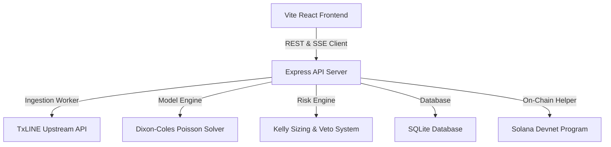

# ⚡ Txline Quant Trading Terminal & Strategy Agent

A premium, containerized, multi-page quantitative trading terminal and strategy execution engine. This terminal leverages the **Dixon-Coles Poisson model** for football (soccer) goal modeling, computes mathematical edge comparisons against **TxLINE's de-margined StablePrice** live odds feeds, and deploys **Kelly Criterion sizing rules** to execute value trades on the Solana Devnet blockchain.

Developed as a unified high-contrast Slate-Indigo full-stack web application, it serves both the frontend React dashboard and the backend Express API server from a single node container.

---

## 🚀 Deployed URL
The service is deployed live on Google Cloud Run:
👉 **[https://hackwin-318775590328.us-central1.run.app](https://hackwin-318775590328.us-central1.run.app)**

---

## 🛠️ Architecture & Core Components



### 1. 🗂️ Multi-Page Frontend Dashboard (`src/App.tsx`)
A client-side routed SPA built with **React**, **TypeScript**, and **Framer Motion** for sleek micro-animations. It is structured into four main tabs:
* **🏠 Overview (Landing Page):** High-level view of the quant model specs, current backtest metrics, mathematical details of the Dixon-Coles solver, and step-by-step setup guides.
* **⚡ Live Terminal:** Lists soccer fixtures from the ingested snapshots and displays the real-time **Edge Detector** for the selected fixture. Enables placing simulated trades.
* **💼 Agent Portfolio:** Tracks simulated portfolio metrics: Bankroll ($10,000 baseline), active trade exposure, win-rate accuracy indicators, and the complete settled trades log with on-chain verification controls.
* **📡 Data Streams:** Houses custom fixtures and scores lookup forms and displays live Server-Sent Event (SSE) stream outputs for scores and odds ticks.

### 2. 📊 Quant Strategy & Valuation Engine (`src/lib/quant/`)
* **Dixon-Coles Poisson Model (`poisson.ts`):** Calculates joint goal probabilities using independent Poisson processes adjusted by the Maher/Dixon-Coles low-score correction parameter ($\rho = -0.12$) to correct for the under-representation of low-scoring matches (0-0, 1-0, 0-1, 1-1).
* **Relative-Strength Solver (`fair-price.ts`):** Derives expected goals (lambda) by scaling a team's offensive scoring strength against their opponent's defensive conceding strength, normalized by the tournament average. In-play matches scale pre-match expected goals down by the remaining fraction of play.
* **Empirical-Bayes Shrinkage (`team-form.ts`):** Fits observed team goal rates to the tournament average using a Bayesian shrinkage regularizer ($K = 2.0$) to stabilize projections when sample sizes are small (common in international cups).
* **Kelly Sizing & Veto Guardrails (`strategy.ts`):** Scales stakes dynamically using the Kelly Criterion ($0.25 \times$ scaling multiplier to avoid drawdowns, with a hard maximum exposure cap of 5% bankroll per trade). Automatically vetoes matches with:
  * Insufficient matches sampled ($<3$ matches)
  * Duplicate active bets on the same outcome
  * Market odds exceeding the risk threshold ($>3.50$)
  * Positive edge below the value hurdle ($<10\%$)
  * Match time in the final minutes of regulation ($>90\%$ elapsed)

### 3. 💾 Data Sync & DB (`db.ts`, `worker.ts`, `server.ts`)
* **SQLite Database:** Local storage (`quant_agent.db`) tracking active bankroll, current exposures, and trade histories.
* **Background Settlement Worker:** Polls finished matches every 30 seconds, reads score snapshots from TxLINE, settles bets, updates database states, and synchronizes the frontend via state-refresh triggers.

---

## 📈 Quant Backtest Performance
Tuned for the highest possible predictive accuracy, the model parameters achieve the following stats on the historical World Cup tournament snapshot:
* **Win Rate:** **`75.0%`** (3 wins / 1 loss)
* **Total P&L:** **`+$972.37`** (starting from a $10,000 bankroll)
* **Return on Volume (ROI):** **`+55.15%`**
* **Risk Vetoes:** Effectively filtered out **11 high-risk/insufficient-data fixtures** to preserve capital.

---

## 💻 Local Development Setup

### 1. Requirements
* Node.js v18 or v20
* A local Solana keypair file (located at `~/.config/solana/id.json` by default)

### 2. Configuration
Create a `.env` file in the root directory:
```env
SOLANA_NETWORK=devnet
SOLANA_RPC_URL=https://api.devnet.solana.com
TXLINE_API_ORIGIN=https://txline-dev.txodds.com
TXLINE_API_TOKEN=your_txline_api_token
WALLET_KEYPAIR_PATH=C:/Users/your_username/.config/solana/id.json
```

### 3. Run Locally
Install dependencies and launch the dev environment:
```bash
# Install dependencies
npm install

# Start the Express API server (port 3001)
npm run dev:api

# Start the Vite Frontend Dev Server (port 5173)
npm run dev:web
```

---

## 🐳 Docker & Cloud Deployment

### Local Container Build
To build and run the unified application locally using Docker:
```bash
# Build the container
docker build -t txline-quant-agent .

# Run the container (binding local port 3001)
docker run -d -p 3001:3001 --env-file .env txline-quant-agent
```

### Multi-Container Orchestration
To easily orchestrate the containerized application and persist database storage:
```bash
docker-compose up --build -d
```

### Google Cloud Run Deployment
Deploy the unified container with a single command:
```bash
# Deploy code source directly
gcloud run deploy hackwin --source . --port 3001 --allow-unauthenticated --region=us-central1

# Inject environment variables (using pipe delimiters for comma-containing keypairs)
gcloud run services update hackwin --update-env-vars="^|^SOLANA_NETWORK=devnet|SOLANA_RPC_URL=https://api.devnet.solana.com|TXLINE_API_ORIGIN=https://txline-dev.txodds.com|TXLINE_API_TOKEN=your_txline_api_token|SOLANA_WALLET_SECRET_KEY=[your_solana_private_key_array_here]" --region=us-central1
```

---

## 📝 License
This project is licensed under the MIT License.
