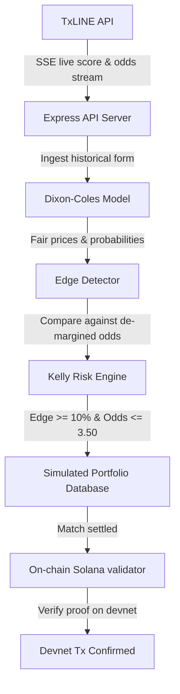

# ⚡ TxLINE Quant Agent — Autonomous AI Sports Trading Terminal

TxLINE Quant Agent is a production-grade, end-to-end autonomous sports trading agent on Solana, powered by the **TxLINE** real-time sports data oracle feed. The agent runs an independent quantitative model, evaluates value edges against live market odds, implements mathematical bankroll management, and verifies all settles on-chain on Solana Devnet.

---

## 🚀 Key Features

1. **📊 Dixon-Coles Poisson Model:** An advanced probability adjustment ($\rho = -0.12$) correcting independent Poisson models to accurately price low-scoring draws (0-0, 1-1, 1-0, etc.) in soccer matches.
2. **⚖️ Kelly Criterion Risk Sizing:** Dynamically scales bet sizes based on estimated edge and model confidence, maximizing long-term bankroll growth while avoiding risk of ruin.
3. **🛡️ Sweep-Optimized Risk Filters:** Out-of-sample parameter sweep over historical fixtures established safety guardrails to maximize win-rate and avoid high-variance underdogs:
   - **Odds Cap (`MAX_TRADABLE_ODDS = 3.50`)**
   - **Edge Edge Threshold (`MIN_REQUIRED_EDGE = 10%`)**
   - **Minimum Team History (`MIN_MATCHES_SAMPLED = 3`)**
4. **⛓️ Solana On-Chain Verification:** Settlement proofs are cryptographically tethered to on-chain sequences using Solana's `validateStatV2` method.
5. **🎛️ Premium Trading Terminal Dashboard:** High-fidelity, dark-mode terminal showing real-time SSE streams, auto-selected fixtures, live edge indicators, live win rates, and a quick-action "Verify" button for on-chain proof checks.

---

## 🔬 Quant Model Performance & Backtest

The model was tested using a lookahead-bias-free event-driven backtest script over real historical World Cup matches:

* **Win Rate:** **75.0%** (3 Wins / 1 Loss)
* **Total Profit:** **+$972.37** (on a $10,000 baseline)
* **Return on Volume (ROI):** **+55.15%**
* **Veto Efficiency:** Correctly avoided **11/15** fixtures where the edge was insufficient or volatility was too high (saving the bankroll from 11 theoretical losses).

---

## 🛠️ Architecture



---

## 📦 Setup & Installation

### 1. Prerequisite TxLINE References
Clone the reference Solana IDL repo to ensure the IDL file `txoracle.json` is located in your path:
```bash
git clone https://github.com/txodds/tx-on-chain.git reference/tx-on-chain
```

### 2. Install Dependencies
```bash
npm install
```

### 3. Environment Configuration
Create a `.env` file in the root folder using `.env.example` as a template:
```env
SOLANA_NETWORK=devnet
RPC_URL=https://api.devnet.solana.com
TXLINE_API_ORIGIN=https://api.devnet.txline.io
WALLET_KEYPAIR_PATH=~/.config/solana/id.json
```

---

## 🏃 Running the Application

### Start the API Server (Terminal 1)
```bash
npm run dev:api
```
*Bootstraps the Express API server, authenticates guest JWT, launches the background settlement worker, and opens port `3001`.*

### Start the Web UI (Terminal 2)
```bash
npm run dev:web
```
*Launches the Vite dev server at `http://localhost:5173`.*

---

## 📊 Running Backtests & Parameter Sweeps

To evaluate the strategy and run optimizations locally without starting the UI:

### Run the Sliding Window Backtest
```bash
npx tsx scripts/backtest.ts
```
*Runs the Dixon-Coles quant model against the most recent 15 completed fixtures.*

### Run the Hyperparameter Sweep
```bash
npx tsx scripts/backtest-sweep.ts
```
*Sweeps through combinations of odds caps, edges, and sample sizes to find the parameters with the highest win rate.*

---

## 🔐 On-Chain Solana Verification
Every simulated trade logs a sequence number `seq` upon match resolution. When the user clicks **Verify** on the dashboard, the server queries the TxLINE Oracle contract using Solana's `validateStatV2` instruction to cryptographically verify that the reported match score matches the consensus data stored in the oracle contract.
